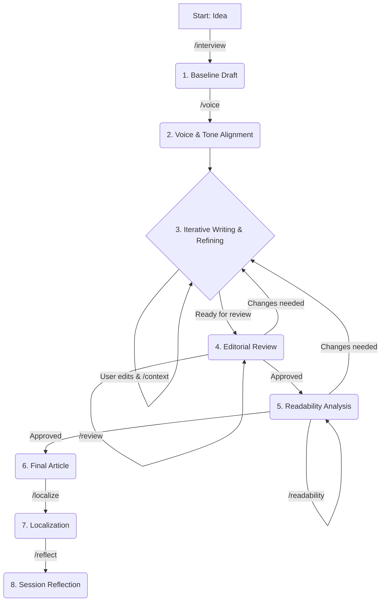

# Speedgrapher

Speedgrapher is a local MCP server written in Go, designed to assist writers by providing a suite of tools to streamline the writing process.

## What is it?

Speedgrapher is an MCP server designed to assist professional writers, with a particular focus on those in the tech industry. It provides a suite of tools and resources to streamline the writing process, from research and drafting to editing and publishing. The server is designed to be used as a local companion, running on the writer's own machine.

## How it works

Speedgrapher is written in Go and implements the Model Context Protocol (MCP). It uses the [official Go SDK for MCP](https://github.com/modelcontextprotocol/go-sdk) and communicates over the `stdio` transport layer. This design choice makes it a lightweight and secure local server, with no need for network deployment.

## Available Tools

### Gunning Fog Index

The `fog` tool calculates the Gunning Fog Index for a given text. The Gunning Fog Index is a readability test that estimates the years of formal education a person needs to understand a text on the first reading.

The tool returns not only the numerical Fog Index but also a qualitative classification to help writers calibrate their text for a specific audience.

**Classification Levels:**

*   **Unreadable:** (Score >= 22) - Likely incomprehensible to most readers.
*   **Hard to Read:** (Score 18-21) - Requires significant effort, even for experts.
*   **Professional Audiences:** (Score 13-17) - Best for readers with specialized knowledge.
*   **General Audiences:** (Score 9-12) - Clear and accessible for most readers.
*   **Simplistic:** (Score < 9) - May be perceived as childish or overly simple.

## Available Prompts

Speedgrapher's functionality is exposed through a series of prompts, which can be used as slash commands in a compatible client.

| Command | Description | Example |
| --- | --- | --- |
| `/context` | Loads the current work-in-progress article to context for further commands. | `/context` |
| `/haiku` | Creates a haiku about a given topic. | `/haiku topic="Go programming"` |
| `/interview` | Interviews an author to produce a technical blog post. | `/interview` |
| `/localize` | Translates the article currently being worked on into a target language. | `/localize target_language="Brazilian Portuguese"` |
| `/readability` | Analyzes the last generated text for readability using the Gunning Fog Index. | `/readability` |
| `/reflect` | Analyzes the current session and proposes improvements to the development process. | `/reflect` |
| `/review` | Reviews the article currently being worked on against the editorial guidelines. | `/review` |
| `/voice` | Analyzes the voice and tone of the user's writing to replicate it in generated text. | `/voice hint="~/Documents/my-articles"` |

## Example Editorial Workflow

Speedgrapher is designed to support a flexible and iterative writing process. Below is a refined workflow that takes an idea from a brainstorming session to a polished, reviewed, and self-improving cycle.

### The Flow in Words

1.  **Ideation (`/interview`):** The journey begins with an idea. Use the `/interview` prompt to have a conversation with the model, which acts as a writing partner to help you flesh out your concept and generate a baseline draft.

2.  **Voice Alignment (`/voice`):** To ensure the article sounds like you, use the `/voice` prompt early in the process. Provide a `hint` pointing to your existing work, and the model will adopt your unique style for all subsequent text generation.

3.  **Iterative Refinement (`/context`):** This is the core writing loop. As you provide instructions and edits, use the `/context` command frequently. This ensures the model always has the latest version of your article loaded, ready for your next command.

4.  **Editorial Review (`/review`):** Once you have a solid draft, run the `/review` command to check the article against the project's editorial guidelines. This will provide constructive feedback on structure, tone, and narrative. If changes are needed, loop back to the refinement step.

5.  **Readability Analysis (`/readability`):** After the editorial review is complete, use the `/readability` command to check the Gunning Fog Index. This helps ensure your article is accessible to your target audience. If the score is too high or too low, you can loop back to the refinement step.

6.  **Localization (`/localize`):** Once the article is polished and approved, you can use the `/localize` command to translate it into other languages.

7.  **Session Reflection (`/reflect`):** This is the final and most crucial step. After your work is done, use the `/reflect` command to trigger a self-improvement analysis of the entire session. The model will identify key learnings and propose concrete improvements for future collaborations.

### The Flow in a Diagram



## Getting Started

To get started with Speedgrapher, you'll need to have Go installed on your system.

### Building the server

You can build the server by running the following command:

```bash
make build
```

This will create an executable file at `bin/speedgrapher`.

### Testing the server

To test that the server is running correctly, you can send it an `initialize` request, followed by an `initialized` notification and a `prompts/list` request. The server will respond with its capabilities and a list of available prompts if it is successful.

```bash
(
  echo '{"jsonrpc":"2.0","id":1,"method":"initialize","params":{"protocolVersion":"2025-06-18"}}';
  echo '{"jsonrpc":"2.0","method":"notifications/initialized","params":{}}';
  echo '{"jsonrpc":"2.0","id":2,"method":"prompts/list","params":{}}';
) | ./bin/speedgrapher
```

### Using a prompt

To use a prompt, you can send a `prompts/get` request to the server with the name of the prompt you want to use.

```bash
(
  echo '{"jsonrpc":"2.0","id":1,"method":"initialize","params":{"protocolVersion":"2025-06-18"}}';
  echo '{"jsonrpc":"2.0","method":"notifications/initialized","params":{}}';
  echo '{"jsonrpc":"2.0","id":2,"method":"prompts/get","params":{"name": "interview"}}';
) | ./bin/speedgrapher
```

### Using the `fog` tool

To use the `fog` tool, you can send a `tools/call` request to the server with the text you want to analyze.

```bash
(
    printf '{"jsonrpc":"2.0","id":1,"method":"initialize","params":{"capabilities":{},"implementation":{"name":"test-client","version":"0.0.1"}}}
';
    sleep 1;
    TEXT="Speedgrapher is a local MCP server written in Go, designed to assist writers by providing a suite of tools to streamline the writing process.";
    printf '{"jsonrpc":"2.0","id":2,"method":"tools/call","params":{"name":"fog","arguments":{"text":"%s"}}}
' "$TEXT";
) | ./bin/speedgrapher
```

The server will respond with a JSON object containing the Gunning Fog Index, the classification, and all the partial metrics.

```json
{
  "fog_index": 16.27,
  "classification": "Professional Audiences: Best for readers with specialized knowledge.",
  "total_words": 24,
  "total_sentences": 1,
  "average_sentence_length": 24,
  "percentage_complex_words": 16.67,
  "complex_words": 4
}
```

## Resources

*   **Model Context Protocol Specification:** [https://modelcontextprotocol.io/specification/2025-06-18](https://modelcontextprotocol.io/specification/2025-06-18)
*   **Go SDK for MCP:** [https://github.com/modelcontextprotocol/go-sdk](https://github.com/modelcontextprotocol/go-sdk)
*   **How to build an MCP server with Gemini CLI and Go:** [https://danicat.dev/posts/20250729-how-to-build-an-mcp-server-with-gemini-cli-and-go/](https://danicat.dev/posts/20250729-how-to-build-an-mcp-server-with-gemini-cli-and-go/)