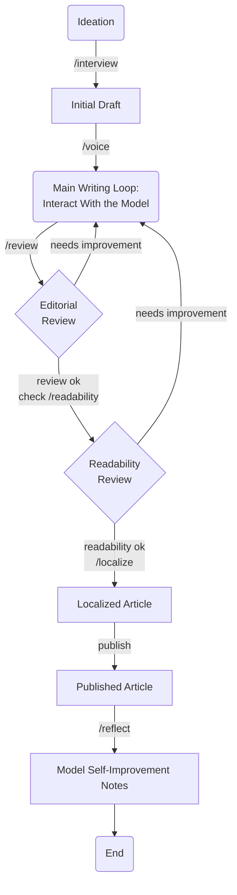

# Speedgrapher

Speedgrapher is a local MCP server written in Go, designed to assist writers by providing a suite of tools to streamline the writing process.

## What is it?

Speedgrapher is an MCP server designed to assist professional writers, with a particular focus on those in the tech industry. It provides a suite of tools and resources to streamline the writing process, from research and drafting to editing and publishing. The server is designed to be used as a local companion, running on the writer's own machine.

## How it works

Speedgrapher is written in Go and implements the Model Context Protocol (MCP). It uses the [official Go SDK for MCP](https://github.com/modelcontextprotocol/go-sdk) and communicates over the `stdio` transport layer. This design choice makes it a lightweight and secure local server, with no need for network deployment.

## Available Tools

### Gunning Fog Index

The `fog` tool calculates the Gunning Fog Index for a given text. The Gunning Fog Index is a readability test that estimates the years of formal education a person needs to understand a text on the first reading.

The tool returns not only the numerical Fog Index but also a qualitative classification to help writers calibrate their text for a specific audience.

**Classification Levels:**

*   **Unreadable:** (Score >= 22) - Likely incomprehensible to most readers.
*   **Hard to Read:** (Score 18-21) - Requires significant effort, even for experts.
*   **Professional Audiences:** (Score 13-17) - Best for readers with specialized knowledge.
*   **General Audiences:** (Score 9-12) - Clear and accessible for most readers.
*   **Simplistic:** (Score < 9) - May be perceived as childish or overly simple.

## Available Prompts

Speedgrapher's functionality is exposed through a series of prompts, which can be used as slash commands in a compatible client.

| Command | Description | Example |
| --- | --- | --- |
| `/context` | Loads the current work-in-progress article to context for further commands. | `/context` |
| `/haiku` | Creates a haiku about a given topic. | `/haiku topic="Go programming"` |
| `/interview` | Interviews an author to produce a technical blog post. | `/interview` |
| `/localize` | Translates the article currently being worked on into a target language. | `/localize target_language="Brazilian Portuguese"` |
| `/readability` | Analyzes the last generated text for readability using the Gunning Fog Index. | `/readability` |
| `/reflect` | Analyzes the current session and proposes improvements to the development process. | `/reflect` |
| `/review` | Reviews the article currently being worked on against the editorial guidelines. | `/review` |
| `/voice` | Analyzes the voice and tone of the user's writing to replicate it in generated text. | `/voice hint="~/Documents/my-articles"` |

## Example Editorial Workflow

Speedgrapher is designed to support a clear and iterative writing process. Below is a simplified workflow that leverages the available prompts to take an idea from concept to a polished, published article.

### The Flow in Words

The writing process is a cycle of ideation, drafting, and revision.

1.  **Ideation & Initial Draft:** The process begins with an idea. Use the `/interview` prompt to brainstorm with the model, which will help you flesh out your concept and generate an initial draft.
2.  **Voice Alignment:** Use the `/voice` prompt to align the model with your unique writing style, ensuring the generated text sounds authentic.
3.  **Main Writing Loop:** This is the core creative phase. You will interact with the model to write, edit, and refine the article until you have a solid draft.
4.  **Review & Revision:**
    *   **Editorial Review:** Use the `/review` command to check the draft against editorial guidelines. If it needs improvement, the feedback will guide you as you loop back to the **Main Writing Loop**.
    *   **Readability Review:** Once the editorial review is complete, use the `/readability` command to check its accessibility. If it needs improvement, you can loop back to the **Main Writing Loop**.
    *   **Note on Context:** To ensure the review tools have the most up-to-date content, it is good practice to run `/context` before the `/review` and `/readability` commands.
5.  **Finalization:**
    *   **Localization:** Use the `/localize` command to translate the approved article into other languages.
    *   **Publish:** The final step before reflection is to publish your work.
6.  **Reflection:** At the end of the session, use the `/reflect` prompt to have the model analyze the collaboration and generate notes on how to improve the process for the next time.

### The Flow in a Diagram



## Getting Started

To get started with Speedgrapher, you'll need to have Go installed on your system.

### Building the server

You can build the server by running the following command:

```bash
make build
```

This will create an executable file at `bin/speedgrapher`.

### Testing the server

To test that the server is running correctly, you can send it an `initialize` request, followed by an `initialized` notification and a `prompts/list` request. The server will respond with its capabilities and a list of available prompts if it is successful.

```bash
(
  echo '{"jsonrpc":"2.0","id":1,"method":"initialize","params":{"protocolVersion":"2025-06-18"}}';
  echo '{"jsonrpc":"2.0","method":"notifications/initialized","params":{}}';
  echo '{"jsonrpc":"2.0","id":2,"method":"prompts/list","params":{}}';
) | ./bin/speedgrapher
```

### Using a prompt

To use a prompt, you can send a `prompts/get` request to the server with the name of the prompt you want to use.

```bash
(
  echo '{"jsonrpc":"2.0","id":1,"method":"initialize","params":{"protocolVersion":"2025-06-18"}}';
  echo '{"jsonrpc":"2.0","method":"notifications/initialized","params":{}}';
  echo '{"jsonrpc":"2.0","id":2,"method":"prompts/get","params":{"name": "interview"}}';
) | ./bin/speedgrapher
```

### Using the `fog` tool

To use the `fog` tool, you can send a `tools/call` request to the server with the text you want to analyze.

```bash
(
    printf '{"jsonrpc":"2.0","id":1,"method":"initialize","params":{"capabilities":{},"implementation":{"name":"test-client","version":"0.0.1"}}}
';
    sleep 1;
    TEXT="Speedgrapher is a local MCP server written in Go, designed to assist writers by providing a suite of tools to streamline the writing process.";
    printf '{"jsonrpc":"2.0","id":2,"method":"tools/call","params":{"name":"fog","arguments":{"text":"%s"}}}
' "$TEXT";
) | ./bin/speedgrapher
```

The server will respond with a JSON object containing the Gunning Fog Index, the classification, and all the partial metrics.

```json
{
  "fog_index": 16.27,
  "classification": "Professional Audiences: Best for readers with specialized knowledge.",
  "total_words": 24,
  "total_sentences": 1,
  "average_sentence_length": 24,
  "percentage_complex_words": 16.67,
  "complex_words": 4
}
```

## Resources

*   **Model Context Protocol Specification:** [https://modelcontextprotocol.io/specification/2025-06-18](https://modelcontextprotocol.io/specification/2025-06-18)
*   **Go SDK for MCP:** [https://github.com/modelcontextprotocol/go-sdk](https://github.com/modelcontextprotocol/go-sdk)
*   **How to build an MCP server with Gemini CLI and Go:** [https://danicat.dev/posts/20250729-how-to-build-an-mcp-server-with-gemini-cli-and-go/](https://danicat.dev/posts/20250729-how-to-build-an-mcp-server-with-gemini-cli-and-go/)