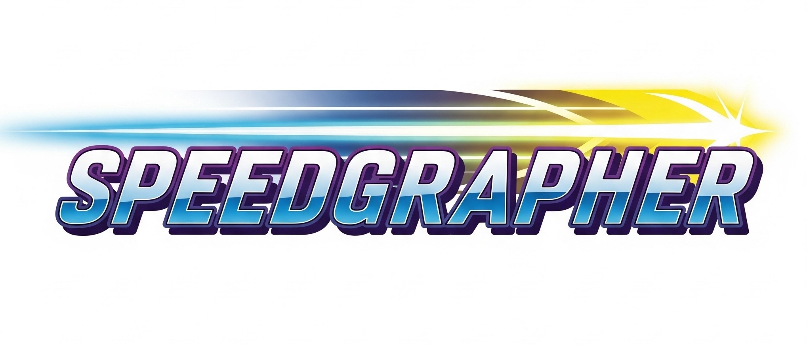

# Speedgrapher

> This is not an officially supported Google product.

Speedgrapher is a local MCP server written in Go, designed to assist writers by providing a suite of tools to streamline the writing process. It features automated editorial reviews, brainstorming tools, and style analysis.

## Modernized Workflow with Editorial Skills

Speedgrapher is designed to work with specialized AI skills that encapsulate the editorial process. When installed as a Gemini CLI extension, you get four expert personas:

*   **`tech-interviewer`**: Your brainstorming partner. Use it to flesh out ideas, collect data, and generate structured outlines.
*   **`tech-writer`**: Your drafting companion. It focuses on style, voice alignment, and narrative flow following the "cozy web" principles.
*   **`tech-reviewer`**: Your quality gate. It uses analytical tools (`fog`, `slop`, `vale`) to ensure your article is readable, authentic, and professional.
*   **`tech-publisher`**: Your final checklist expert. It handles SEO audits, localization, and prepares a publication plan.

## Available Tools

*   **Gunning Fog Index (`fog`)**: Calculates a readability score. Aim for "General" or "Professional" audience levels.
*   **Slop Score (`slop`)**: Calculates a score (0-100) to detect common AI clichés (like "delve", "tapestry"). Lower scores indicate more natural writing. Cliché patterns are based on the excellent work at [tropes.fyi](https://tropes.fyi/).
*   **Vale Static Analysis (`vale`)**: Runs `vale` to check for style and grammar issues. **Note:** Speedgrapher automatically downloads and manages a secure, pinned version of `vale` (v3.13.1) upon first use.

## Available Prompts (Slash Commands)

The following essential commands are available for direct action:

| Command | Description |
| --- | --- |
| `/interview` | Starts a structured interview to gather material for a post. |
| `/review` | Performs a comprehensive review using `fog`, `slop`, and `vale`. |
| `/readability` | Quick check of the Fog Index for the last generated text. |

## Installation & Setup

The recommended way to install Speedgrapher is as a **Gemini CLI extension**. This automatically handles the binary installation, MCP server configuration, and editorial skills.

### 1. Recommended: Install as an Extension

Run the following command in your terminal:

```bash
gemini extensions install https://github.com/danicat/speedgrapher
```

### 2. Manual Installation (Alternative)

If you are developing locally or prefer manual control:

#### A. Install the Binary
Build and install the `speedgrapher` binary to your `$GOPATH/bin`:

```bash
make install
```

#### B. Configure MCP Server
Add this configuration to your `~/.gemini/settings.json`:

```json
{
    "mcpServers": {
        "speedgrapher": {
            "command": "$HOME/<path to your speedgrapher directory>/bin/speedgrapher"
        }
    }
}
```

#### C. Install Editorial Skills
Install the skills from the `skills/` directory:

```bash
gemini skills install skills/tech-interviewer --scope user
gemini skills install skills/tech-writer --scope user
gemini skills install skills/tech-reviewer --scope user
gemini skills install skills/tech-publisher --scope user
```
After installation, reload your skills in the interactive CLI with `/skills reload`.


## Development

### Prerequisites

*   [Go](https://go.dev/doc/install) 1.24 or later
*   [Goreleaser](https://goreleaser.com/install/) (for building distributions)

### Building and Testing

The project uses a `Makefile` to manage common development tasks.

*   **Build:** Creates an executable named `speedgrapher` in the root.
    ```bash
    make build
    ```
*   **Test:** Runs the Go test suite.
    ```bash
    make test
    ```
*   **Clean:** Removes the executable and `dist` directories.
    ```bash
    make clean
    ```

## License
This project is licensed under the Apache License, Version 2.0. See [LICENSE](LICENSE) for details.

## References
*   **Model Context Protocol Specification:** [https://modelcontextprotocol.io/specification/2025-06-18](https://modelcontextprotocol.io/specification/2025-06-18)
*   **Go SDK for MCP:** [https://github.com/modelcontextprotocol/go-sdk](https://github.com/modelcontextprotocol/go-sdk)
*   **How to build an MCP server with Gemini CLI and Go:** [https://danicat.dev/posts/20250729-how-to-build-an-mcp-server-with-gemini-cli-and-go/](https://danicat.dev/posts/20250729-how-to-build-an-mcp-server-with-gemini-cli-and-go/)

