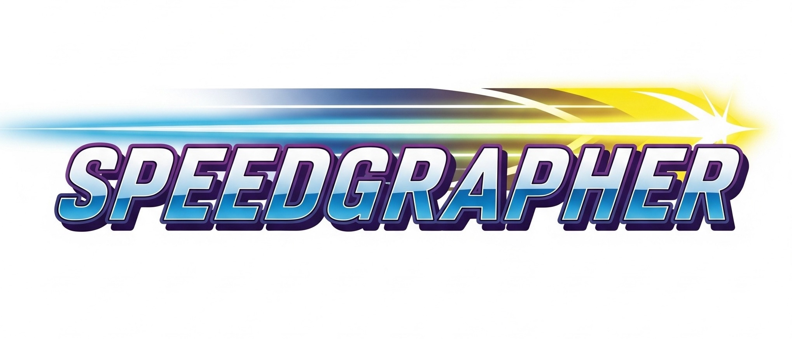

# Speedgrapher

> This is not an officially supported Google product.

Speedgrapher is a local MCP server that helps you write better technical articles. It runs style checks, readability tests, and automated editorial reviews right from your terminal.

## Quick start

Install Speedgrapher as a Gemini CLI extension to automatically compile the binary, configure the MCP server, and register all editorial personas:

```bash
gemini extensions install https://github.com/danicat/speedgrapher
```

## Editorial personas

When you install Speedgrapher as a Gemini CLI extension, it registers four expert personas to guide you through drafting and polishing:

* **`tech-interviewer`**: Interviews you about your technical topic to extract raw logs, error messages, and core lessons. It then drafts a solid structural outline.
* **`tech-writer`**: Drafts the article with you, focusing on a clear, conversational narrative voice that follows cozy web principles.
* **`tech-reviewer`**: Audits the draft against editorial guidelines using analytical tools to flag style issues, readability scores, and AI slop patterns.
* **`tech-publisher`**: Audits page SEO, manages article localization, and runs final checks before publication.

## Built-in tools

* **Gunning Fog Index (`fog`)**: Evaluates text readability to ensure the content matches general or professional readers.
* **Slop Score (`slop`)**: Grades text from 0 to 100 by counting overused LLM clichés (for example, "delve" or "tapestry"). Lower scores mean more natural, human writing. The slop score matches clichés against the database at [tropes.fyi](https://tropes.fyi/).
* **Vale Static Analysis (`vale`)**: Analyzes style guidelines and grammar. Speedgrapher automatically downloads and verifies a secure, pinned version of `vale` (v3.13.1) during its first execution.

## Interactive prompts (slash commands)

Run these commands in the terminal to execute workflows:

| Command | Description |
| --- | --- |
| `/interview` | Starts an interview to extract raw details for your post. |
| `/review` | Audits the current article draft using `fog`, `slop`, and `vale`. |
| `/readability` | Displays a quick Fog Index readability report for the last generated text. |

## Developer setup

If you are developing locally or prefer manual control, you can compile and configure the server manually.

### 1. Compile and install the binary
Install the `speedgrapher` binary to your `$GOPATH/bin`:

```bash
make install
```

### 2. Register MCP server
Add this configuration to your `~/.gemini/settings.json`:

```json
{
    "mcpServers": {
        "speedgrapher": {
            "command": "$HOME/<path to your speedgrapher directory>/bin/speedgrapher"
        }
    }
}
```

### 3. Register editorial skills
Install each skill from the `skills/` directory:

```bash
gemini skills install skills/tech-interviewer --scope user
gemini skills install skills/tech-writer --scope user
gemini skills install skills/tech-reviewer --scope user
gemini skills install skills/tech-publisher --scope user
gemini skills install skills/inverted-pyramid --scope user
```
After registering, reload the active session with `/skills reload`.

## Build and test commands

The project uses a `Makefile` to handle development tasks.

### Prerequisites

* [Go](https://go.dev/doc/install) 1.24 or later
* [Goreleaser](https://goreleaser.com/install/) (for release distribution packaging)

### Makefile commands

* **Build executable**: Compiles a local `speedgrapher` executable in the root directory.
  ```bash
  make build
  ```
* **Run tests**: Runs the entire Go test suite.
  ```bash
  make test
  ```
* **Clean workspace**: Removes local binaries and temporary build directories.
  ```bash
  make clean
  ```

## Development architecture

Speedgrapher follows a strict evolutionary documentation and safety gate pipeline. Key technical choices are recorded using the Architecture Decision Record (ADR) framework under the `/design/adr` directory:

1. **[ADR-0001: Record Architecture Decisions](design/adr/0001-record-architecture-decisions.md)**: Establishes the ADR system and retires the manual changelog.
2. **[ADR-0002: Automated Vale Bootstrapping](design/adr/0002-automated-vale-bootstrapping.md)**: Details the runtime dynamic downloader and SHA256 verification gate for the `vale` binary.
3. **[ADR-0003: Stdio Model Context Protocol Transport](design/adr/0003-stdio-model-context-protocol-transport.md)**: Records the security and isolation choices for using standard streams over network sockets.
4. **[ADR-0004: Replace Changelog with Evolutionary Documentation](design/adr/0004-replace-changelog-with-evolutionary-documentation.md)**: Solidifies the transition from manual files to git tag records and ADR histories.
5. **[ADR-0005: Enforce Version Alignment to Git Tags and Extension Manifest](design/adr/0005-source-of-truth-for-versions-is-git-tags.md)**: Details the three-tiered verification gate (Makefile, GoReleaser hooks, and CI/CD steps) that blocks version drift during release cycles.

## License
This project is licensed under the Apache License, Version 2.0. See [LICENSE](LICENSE) for details.

## References
*   **Model Context Protocol Specification:** [https://modelcontextprotocol.io/specification/2025-06-18](https://modelcontextprotocol.io/specification/2025-06-18)
*   **Go SDK for MCP:** [https://github.com/modelcontextprotocol/go-sdk](https://github.com/modelcontextprotocol/go-sdk)
*   **How to build an MCP server with Gemini CLI and Go:** [https://danicat.dev/posts/20250729-how-to-build-an-mcp-server-with-gemini-cli-and-go/](https://danicat.dev/posts/20250729-how-to-build-an-mcp-server-with-gemini-cli-and-go/)

