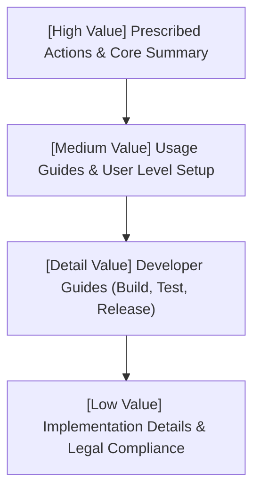

# Inverted Pyramid Documentation Model (Reverse Triangle)

This skill provides editorial guidelines for structuring technical articles, README files, and documentation using the **inverted pyramid** model. It ensures that the highest-value information is placed at the absolute beginning, allowing readers to extract value immediately, with details cascading downward in value.

---

## 1. Trigger Conditions
Activate this skill when:
- Structuring, refactoring, or writing project `README.md` files.
- Drafting technical user guides, API manuals, or tool instructions.
- Auditing existing documentation for value-scannability and reading efficiency.

---

## 2. Core Philosophy: Information Cascading

The **inverted pyramid** structure places the most critical, high-impact, or actionable information at the top, followed by secondary user details, operational steps, and finally developer/legal low-impact implementation details:

---

## 3. README Structural Sequence

For `README.md` and user-facing project guides, documents **must** follow this exact sequence:

1. **Title & High-Impact Summary**: A short, active hook explaining what the project is, what problem it solves, and its high-level capabilities.
2. **Prescribed Actions (Quick Start)**: Immediate, copy-pasteable installation or execution commands (the highest-value action a user can take).
3. **User Documentation & Usage Guides**: Clear details on tools, prompts, command-line flags, and standard user workflows.
4. **Developer Instructions (Build, Test, Release)**: How to compile locally, execute test suites, run linters, and trigger release hooks.
5. **Development Documentation (Implementation Details)**: In-depth technical architecture, package structures, and internal mechanics.
6. **Legal & Compliance**: Copyright notices, license specifications, and support boundaries (the lowest value/least active piece of information).

---

## 4. Writing Principles

- **Lead with Action**: Do not hide installation instructions behind paragraphs of architectural theory. Let the user run the tool first.
- **Vary Reading Depth**: Ensure the document caters to three reading styles:
  - *The Scanner (3 seconds)*: Reads the title and copies the quick-start command.
  - *The Operator (3 minutes)*: Reads the usage tables and workflow guides.
  - *The Contributor (30 minutes)*: Reads the build and architecture details.
- **Sentence Case Headings**: Always keep headings in sentence case, prioritizing high-value nouns first.
